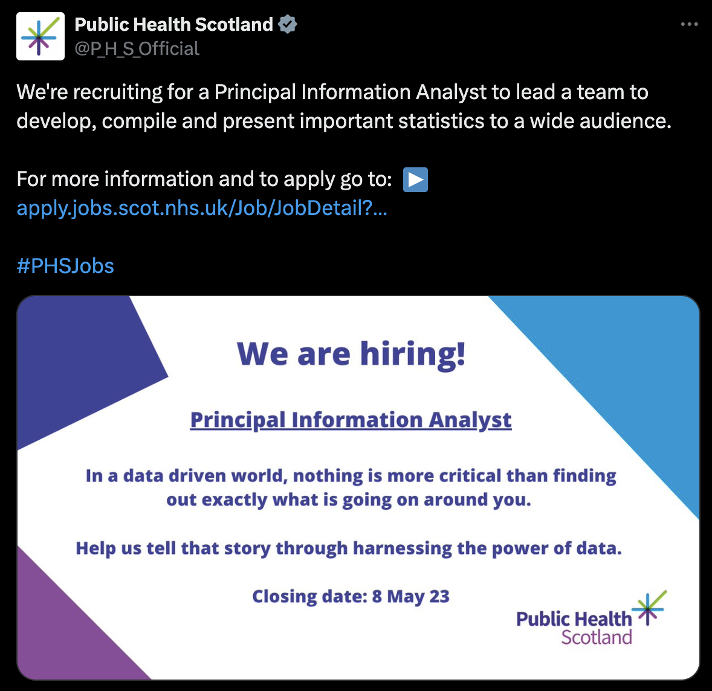
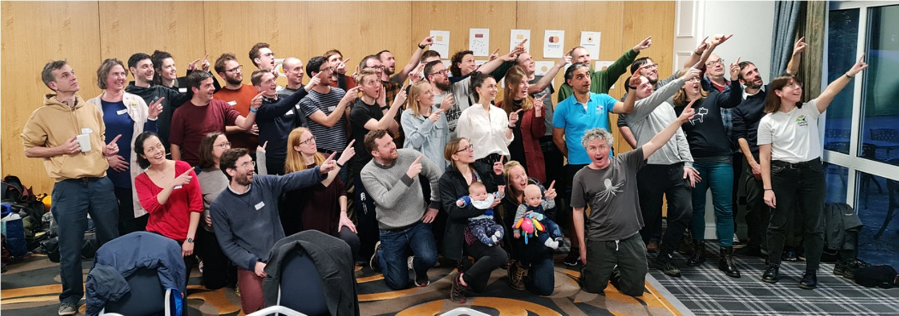

# A career timeline: from academia to the NHS
Dr Lisa Hopcroft
UofG CompBio meet up, October 2024

---

# Who am I?

- Senior Technical Consultant at [National Service Scotland](https://www.nss.nhs.scot/)
  *We provide services and advice to the NHS and wider public sector*

- Building data products for NHS in Scotland via [Seer platform](https://www.gov.scot/news/digital-tech-to-drive-health-and-social-care-innovation/) 💉🩺🧫👩🏽‍⚕️
  - Vaccinations, screening programme data, cancer intelligence data, ...
  - Data engineering: databases, ETL, data virtualisation, dashboards
  - Increasingly cloud based

---

# Academic career (on paper)

- **2000-2009: Education**
  - BSc AI & Psychology &rarr; MRes Bioinformatics &rarr; PhD Bioinformatics 
- **2009-2017: Postdoc-ing**
  - short/longer term contracts in University of Glasgow
  - inspirational and very encouraging mentor (Prof Tessa Holyoake)
  - good publication record (✨Nature paper✨)
- **2017-2018: Research fellow**
  - won two research fellowships (5 years)
  - money for PhD students and staff

---

# Academic career (behind the scenes)

  

  ### I felt...

  - No conscious career decisions 🎡
  - One (undesirable) career trajectory 🔭
  - Didn't want to give up ⛏ for ✍🏻💰
  - Didn't know what else I could do
  - Half hearted job apps had failed

  

  

  

  
  

---

# Academic career (behind the scenes)

  

  ### I felt...

  - No conscious career decisions 🎡
  <!------
  On a treadmill that I didn't know how to get off of
  ------>
  - One (undesirable) career trajectory 🔭
  - Didn't want to give up ⛏ for ✍🏻💰
  <!------
  I did not want to be a group leader
  ------>
  - Didn't know what else I could do
  <!------
  But I didn't know what else I could do - I didn't feel like I was trained well enough as a software developer, I was mostly working in isolation (technically)
  ------>
  - Half hearted job apps had failed

  

  

  
  ### But...

  - I enjoyed collaborative work 👩🏻‍🔬👨🏻‍💻👩🏻‍⚕️
  - I enjoyed communication 👩🏻‍🏫📊📝
  - Drip feed of rewards 📰💰🏅
    ...
  - I didn't _HATE_ it all the time 😐

  <!------
  There was a lot that I did like about academia - working with others, building things, writing, visual communication - but a lot that I didn't like - funding applications, precariousness of contracts 
  -------->
  
  

---

---

# ...followed by a realisation...

- PDGE (Computing) - 18 weeks teaching in Paisley

  

- I enjoyed the actual teaching...and I was good at it
- I did not enjoy much else (📄📄📄📄📄, 🔔, 👦🏾👧🏼👦🏻👧🏽👦🏿👧🏻👦🏼👧🏾👦🏽👧🏿...)
- I really, _really_, _**really**_ missed the data and the coding 👩🏻‍💻

---

# So what now?

  

  ### I could have felt...

  - that I'd failed as an academic 
  - that I'd failed as a teacher
  - embarrassed that I was wrong

  

---

# So what now?

  

  ### I could have felt...

  - that I'd failed as an academic 
  - that I'd failed as a teacher
  - embarrassed that I was wrong

  

  

  
  ### But...

  - I *knew* teaching wasn't for me
  - I *knew* I enjoyed collaborating 👩🏻‍🔬👨🏻‍💻👩🏻‍⚕️
  - I *knew* I enjoyed communication 👩🏻‍🏫📊📝
  - I *knew* I loved data and coding 💻
  
  

---

---

# 2019-2021: Public Health Scotland

  - Generic recruitment round for Principal Information Analysts
  - They were looking for someone with R skills and familiarity with clinical research
  - Work/life balance was hugely improved (discovered flexi time is a thing 🥳)
  - Freedom to design and build a robust system for clinical trials reporting
  [CTutils R package on Github](https://github.com/LisaHopcroft/CTutils) 😎

---

---

<!---style scoped>
section {
  justify-content: center;
  text-align: center;
}
</style--->

17 million patient records analysed in 2.5 months? 🤩
Working in Python with software developers? 🤩

---

<!---style scoped>
section {
  justify-content: center;
  text-align: center;
}
</style--->

17 million patient records analysed in 2.5 months? 🤩
Working in Python with software developers? 🤩

**...but it's academia??** 😶

---

# 2021-2023: University of Oxford (OpenSafely)

  - "Start up" mentality - we were on a mission
  - Learning about how I like to work
    🚀 Open source ✨ Tests ❤️‍🔥 CI/CD 🥰 PR 👯‍♀️ automated documentation 🙌🏼

---

...but, in the end, it _was_ academia.

i.e., 
grant applications ✍🏻💰
short-term contracts 😵‍💫
no clear career trajectory 🔭

---

# 2023-present: National Services Scotland

  - Senior Technical Consultant
  - Developing and maintaining data products used across the NHS 💉🩺🧫👩🏽‍⚕️
  
  - First experience of:
    - strict development pipeline (dev &rarr; UAT &rarr; production)
    - ETL, data visualisation, cloud based solutions
    - enterprise-level business intelligence
    - service delivery - the NHS *relies* on our service being available
    - business analysis/requirements capture

---

# A recap

---

# Industry vs academia (vs public services)

<!-------
I haven't worked in the private sector (yet)
There are no hard and fast rules, but...
--------->
- There are hard problems _everywhere_
<!-------
Academia does not have a monopoly on hard and important problems.
--------->
---

# Industry vs academia (vs public services)

<!-------
I haven't worked in the private sector (yet)
--------->
- There are hard problems _everywhere_
<!-------
Academia does not have a monopoly on hard and important problems.
--------->
- Large organisations offer the possibility to try something new with less risk
  ...but can be frustratingly slow to modernize

---

# Industry vs academia (vs public services)

<!-------
I haven't worked in the private sector (yet)
--------->
- There are hard problems _everywhere_
<!-------
Academia does not have a monopoly on hard and important problems.
--------->
- Large organisations offer the possibility to try something new with less risk
...but can be frustratingly slow to modernize
<!-------
--------->
- Workplace culture can vary dramatically and it is important
<!-------
--------->

---

# Industry vs academia (vs public services)

<!-------
I haven't worked in the private sector (yet)
--------->
- There are hard problems _everywhere_
<!-------
Academia does not have a monopoly on hard and important problems.
--------->
- Large organisations offer the possibility to try something new with less risk
...but can be frustratingly slow to modernize
<!-------
--------->
- Workplace culture can vary dramatically and it is important
<!-------
--------->
- Academia gives you _a lot_ of transferable skills
<!-------
Truly - it's boot camp.
--------->
---

# My career hygiene habits

<!-------
Where I am
What I want
What I can learn
What I want to learn
--------->

- Regular, **diarised** reflection
- Look for new opportunities when I feel I've learned all (most) that I can
- Coach teenagers at [Castle Semple Rowing club](https://www.castlesemplerc.co.uk/) 🚣🏻‍♀️

  

---

# Take home messages

- Try to reflect as much as you can, preferably from a distance
<!----------
  - what do you enjoy?
  - how do you like to work?
  - what do you want to learn?
  - what gives you energy?
  
  In retrospect, what I enjoyed from the primary school visit was the communication, the connection with the kids (which I can now satisfy with coaching), being in
the world.
----------->
- Be confident that you have skills that are needed elsewhere, **because you do**
<!----------
You learn so much from working in academia, almost by accident. Writing, interpreting, reading, presenting, willingness to try things, how to collaborate.
----------->
- Talk to people and find out what is out there
  (you can email me at `lisa.hopcroft@nhs.scot`)
<!----------
Find out about the applications process - how does it work, who reviews applications?
Work out what job titles you should be looking for
----------->

---

---

# What have been the most influential events?

- The act of leaving academia for teaching
<!-------
taking control and making a decision for myself for the first time
--------->
- Realising how much I enjoyed coding and working with data
<!-------
I needed the distance from it to realise this, otherwise it was an invisible given
--------->
- Working with software developers ⭐️
<!-------
--------->
- Learning about the software development cycle (especially tests 🧪)
<!-------
If there are any people in here who code and suffer from imposter syndrome, I'm telling you, learning about and implementing tests are the cure. It cured me.
--------->

---
